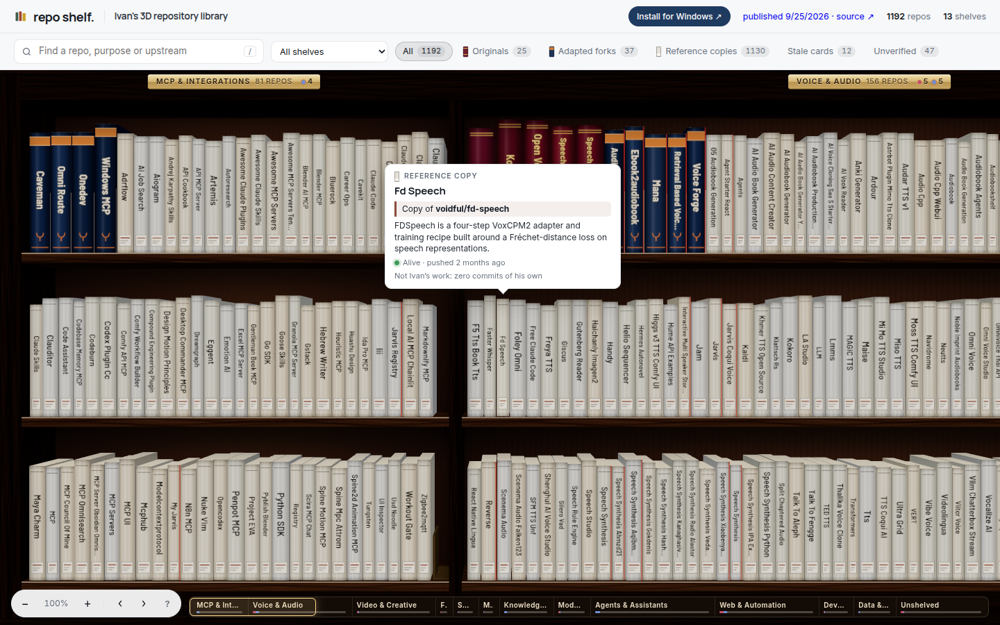
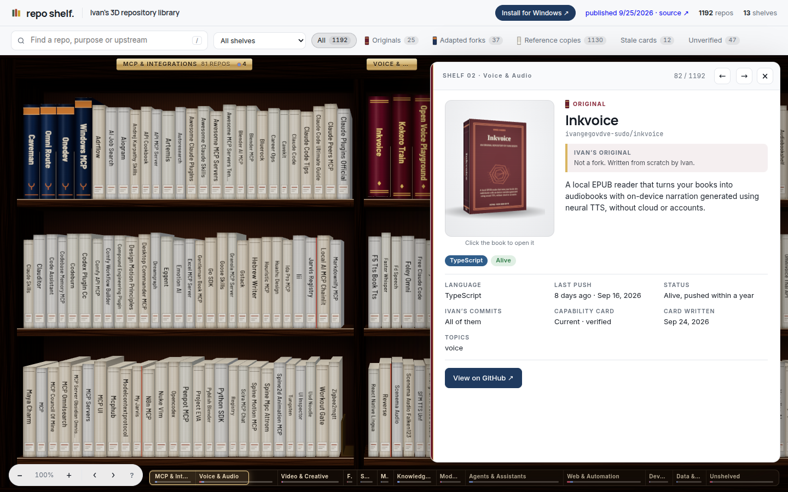
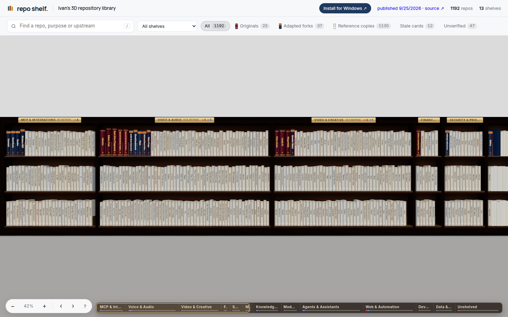
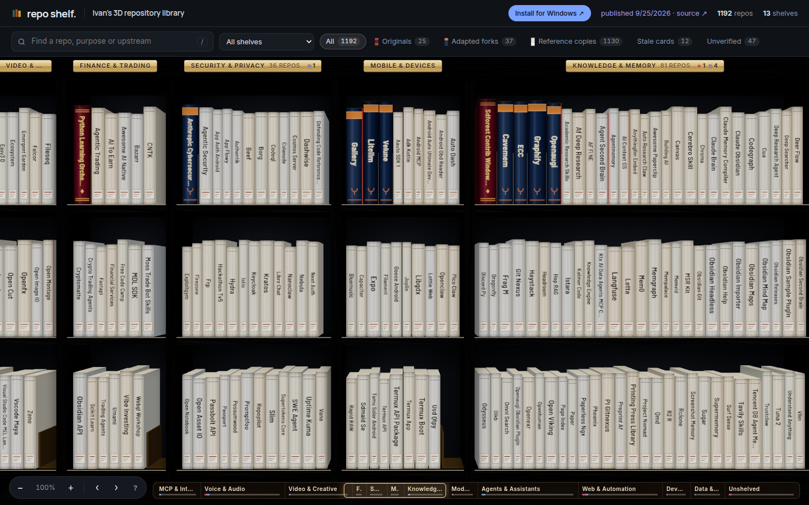
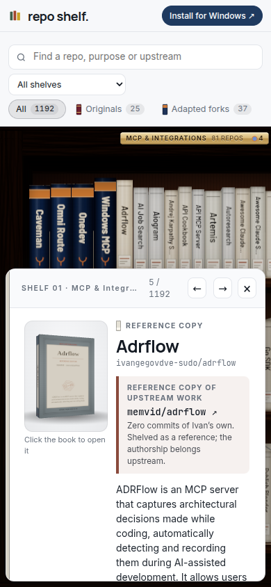

# repo shelf.

[](https://github.com/ivangegovdve-sudo/repo-shelf/actions/workflows/ci.yml) [](LICENSE)

Your git repos as books on a 3D bookshelf. Every root folder you configure is a shelf, every git repo inside it is a book. Hover to browse, click to open, zoom and orbit the case, drag a book to another shelf to move the repo on disk.

Built with React Three Fiber, Express, and `gh`. Runs on your machine only. Windows, macOS and Linux.

This fork also opens with Ivan's public repoindex catalog already bound as books. Shelves are derived from each capability card's purpose, not language or stars. Originals, authored forks, and zero-ahead reference copies use different bindings; every fork names and links to its upstream source. Stale or unverified cards are labelled rather than presented as current facts.

Catalog entries use the app's real 3D book system: varied volume proportions, clothbound purpose palettes, procedural cover art, hinged covers, and readable first pages. Originals appear as substantial first editions, changed forks as adapted editions, and untouched forks as thinner archival reference editions with the upstream printed directly on the cover and spine.



| The library door on your desktop | … swings open | … into the shelf |
| --- | --- | --- |
|  |  |  |

| Open a book (page beside the shelf) | Zoomed out, every shelf | Midnight theme, modern case | Phone |
| --- | --- | --- | --- |
|  |  |  |  |

## Share it


The **Share** menu in the header:

- **Shelfie (PNG)**: the current view with a caption bar (your name, repo count, top languages). 1600px, ready to post.
- **Orbit GIF**: the camera sweeps around your bookcase in a 3-second loop.
- **Rewind GIF**: every book lands on the shelves in the order you created the repos, with a year counter. Or play it on screen without exporting.
- **Publish my shelf…**: one click turns your public repos into a standalone 3D library site on GitHub Pages, at `https://<you>.github.io/<name>/`. Visitors can browse the shelves, open books, and read the READMEs. Private repos, local-only repos, hidden shelves and file paths never leave your machine; the page carries a "get yours" link back here. Re-publish any time, the link stays. There is also **Export folder only** if you want to host it elsewhere.

Exports land in `shelf-exports/` (or *Pictures/repo shelf* from the desktop widget).

## Desktop widget

A small **library door** sits on your desktop (always on top, drag it anywhere). Click it: the doors swing open and the bookshelf window appears. Close the shelf and you are back at the door. Everything you do there is real: move, rename, create folders, create repos, clone, change visibility, all against your actual git folders and your GitHub account.

```bash
npm run desktop        # build once, then launch the widget
npm run dist:win       # Windows installer + portable exe in release/
npm run dist:mac       # macOS .dmg (run on a Mac)
npm run dist:linux     # AppImage
```

The Windows workflow publishes both an NSIS installer and a portable `.exe` to the `catalog-preview` prerelease. The installer is only called working after that Windows runner completes successfully; a local Linux build is not evidence that a Windows installer launches.

If Windows Defender blocks the build with `EPERM ... win-unpacked.tmp`, build to another drive: `npx electron-builder --win --config.directories.output=D:/repo-shelf-release`.

- Tray icon with **Open the shelf / Show the door / Quit**. `Ctrl+Shift+L` (`⌘⇧L` on macOS) toggles the shelf from anywhere.
- The widget starts its own local server on the first free port from 4877 and keeps `shelf.config.json` in your user data folder once installed.
- `npm run desktop:dev` points the widget at the Vite dev server for hot reload while you work on the UI.

## What a book tells you

| Visual | Meaning |
| --- | --- |
| Spine height | Commit count (log scale) |
| Spine thickness | Size on disk excluding `.git`, `node_modules`, build output |
| Spine color | Primary language (GitHub language when available, otherwise a file-extension guess) |
| Faded, washed-out color | Stale: no commit in the last 90 days (configurable) |
| Gold band near the top | Repo has GitHub stars |
| Red tab at the top corner | Uncommitted changes |
| Yellow dot at the bottom | git could not read the repo |
| Dotted outline, "PUBLIC ↗" or "🔒 PRIVATE" | A GitHub or link book: not on disk yet; the lock marks a private repo |
| "ARCHIVED" stamp | Archived on GitHub |
| Gray binding, “UPSTREAM WORK · REFERENCE” | Fork with zero commits ahead; reference copy, not Ivan's work |
| Amber binding, “FORK · n AHEAD” | Fork containing commits of Ivan's own; upstream remains named |
| Green edge, “IVAN'S ORIGINAL” | Repository authored as an original project |

## Actions

From the detail panel or by dragging:

- **Move** a repo to another shelf. Moves the folder on disk. Refuses if the name already exists there, and warns when the repo has uncommitted changes.
- **Rename** a repo. Renames the folder. Optionally also renames it on GitHub and updates `origin` when the repo is owned by your `gh` account.
- **New folder** inside a repo, with an optional `.gitkeep`. Paths are confined to the repo.
- **Open** in VS Code, a terminal (Windows Terminal, Terminal.app, or your Linux default), the file manager, or the GitHub page.
- **Clone** a link or GitHub book onto any of your shelves with `git clone`.
- **Create** a brand-new repo on a shelf: `git init`, README, `.gitignore`, first commit, and optionally `gh repo create --push` as public or private.
- **Make public / private**, **archive**, **delete** repos on your GitHub account from their books on the GitHub shelves.

Every action is logged to `.cache/actions.log`. Nothing is ever deleted.

## Run it

Requirements: Node 24, git. Optional: [GitHub CLI](https://cli.github.com/) logged in (`gh auth login`) for descriptions, stars, topics, and language.

```bash
npm install
npm run dev
```

Open http://127.0.0.1:5177. The API runs on http://127.0.0.1:4877 and only accepts local connections.

Production mode serves the built UI from the API server on one port:

```bash
npm run build
npm start
```

Then open http://127.0.0.1:4877.

## Opening a book

Click a book and it slides out, turns, and its cover swings open on a hinge. Beside the shelf a two-page spread opens: the left page is the repo (facts, actions), the right page turns through **README** (rendered), **Commits**, **Issues**, **Pull requests**, **Files** and **Branches**. Local repos read from disk and git; GitHub books read from the API. Rows longer than the case are clipped at its sides and paged with the arrows.

## GitHub account shelves

Two shelves list every repo on your GitHub account, split into **GitHub · public** and **GitHub · private**, straight from `gh`. Private spines carry a lock. From a book's page you can clone it onto a folder shelf, make it public or private, archive it, or delete it (you type the name to confirm; needs `gh auth refresh -s delete_repo`). Drag a book from the public shelf to the private one to make it private, and back. Repos you don't own are read-only.

```json
{ "label": "GitHub · public", "github": "me", "visibility": "public" }
{ "label": "GitHub · private", "github": "me", "visibility": "private" }
{ "label": "Everything by octocat", "github": "octocat" }
```

## Guide shelves: the Hermes Agent docs as books

A shelf can hold **guides**: each book is one page of a documentation site, bound in leather. Open it and the doc's sections become pages you turn one at a time (`‹ ›`, PageUp/PageDown, Space), rendered inside the book. The default config ships **Hermes Agent · Docs** with the important parts of the [Hermes Agent documentation](https://hermes-agent.nousresearch.com/docs/) in reading order: Quickstart, Installation, Platform Support, Learning Path, CLI, Configuration, Models, Desktop, Bot Mode, Profiles, Tools, Skills, Memory, MCP, Personality, Voice, Messaging, Cron, Delegation, Security, Creating Skills, Plugins, Architecture, CLI Commands, Environment Variables, FAQ.

The text is fetched straight from the docs' markdown source on GitHub (front matter, imports and embeds stripped, admonitions kept as quotes), cached for five minutes, and each book links to the page on the website and to its source. Guides are included when you publish your shelf.

```json
{
  "label": "Hermes Agent · Docs",
  "links": [
    {
      "name": "Quickstart",
      "url": "https://hermes-agent.nousresearch.com/docs/getting-started/quickstart",
      "doc": "NousResearch/hermes-agent:website/docs/getting-started/quickstart.md",
      "description": "From install to your first conversation in under five minutes."
    }
  ]
}
```

`doc` is `owner/repo:path/to/page.md` (fetched raw from GitHub) or any https URL to a markdown file.

## Link shelves and the secret shelf

A shelf can hold links instead of folders. Each link is a GitHub repo (`slug`) or any https URL, shown as a book with a dotted outline. Open it, or clone it onto a real shelf. The default config ships a **Hermes Agent** shelf with a few genuinely useful public repos.

There is also a hidden shelf. Type `hermes` anywhere in the app to reveal it.

```json
{ "label": "Reading list", "links": [{ "slug": "NousResearch/hermes-agent" }, { "name": "Docs", "url": "https://example.com/docs" }] }
{ "label": "Secret", "hidden": true, "links": [{ "slug": "you/your-private-skills" }] }
```

## Themes and bookcase styles

The theme button in the header switches colors (Slate, Library, Midnight, Nordic, Ink, Forest) and the bookcase build (Classic with back panel and crown, Modern slim, Floating planks). Both are remembered per browser.

## Configure shelves

`shelf.config.json` is created on first run:

```json
{
  "shelves": [
    { "label": "Developer", "path": "C:\\Users\\you\\Developer" },
    { "label": "Documents", "path": "C:\\Users\\you\\Documents" },
    { "label": "Home", "path": "C:\\Users\\you" }
  ],
  "staleAfterDays": 90,
  "githubCacheHours": 24
}
```

Shelf order in the file is shelf order on screen. Each folder shelf is scanned one level deep: every immediate sub-folder that contains `.git` becomes a book. Hidden folders are skipped. You can add and remove shelves from the **Shelves** button in the header. On macOS and Linux the default home shelves are `~/Developer`, `~/Documents`, and `~`.

Environment overrides: `SHELF_CONFIG` (config file path), `SHELF_CACHE` (cache directory), `SHELF_PORT` (API port).

`SHELF_CATALOG` overrides the bundled public catalog path. `npm run catalog:refresh -- /path/to/repoindex/catalog.json` refreshes the checked-in public-only snapshot after intersecting it with GitHub's public repository inventory.

The checked-in catalog and public builds intentionally contain only the 1,192 repositories visible through GitHub's public inventory. To browse the complete 1,256-entry repoindex on your own machine, build a separate local-only shelf from the full catalog:

```bash
npm run build:library:local -- /path/to/repoindex/catalog.json
```

Open `catalog-full-site/index.html` directly from disk. The command verifies that every catalog entry became exactly one book. That output is gitignored because it may contain non-public repository names; do not publish it or add it to a release.

## Provenance

The 3D bookshelf application was created by [BkashJEE](https://github.com/BkashJEE/repo-shelf) and remains MIT licensed. This fork's catalog integration and deployment are maintained at [ivangegovdve-sudo/repo-shelf](https://github.com/ivangegovdve-sudo/repo-shelf).

## Keyboard

| Key | Action |
| --- | --- |
| `/` | Focus search |
| `Esc` | Clear search, close panel or dialog |
| `↑` `↓` or mouse wheel | Move between shelves |
| `ctrl` + wheel, trackpad pinch, `+` `-` | Zoom in / out (20% shows the whole case, 800% is nose-on-a-spine) |
| Drag on the wood, or right-drag anywhere | Orbit the bookcase |
| Double-click a book | Zoom right up to it |
| `0` or double-click the wood | Reset the view |
| `←` `→` | Previous / next repo while the panel is open |

## Tests

```bash
npm test          # server + derive unit tests (vitest, real temp git repos)
npm run test:e2e  # Playwright against fixture repos in a temp folder
```

## Layout

```
server/   Express API: config, scanner, GitHub enrichment, actions, SSE
src/      React + R3F UI: scene/ (bookcase, books, camera), ui/ (panel, dialogs), store, derive
tests/    vitest unit tests and Playwright e2e
docs/     design spec and implementation plan
```
