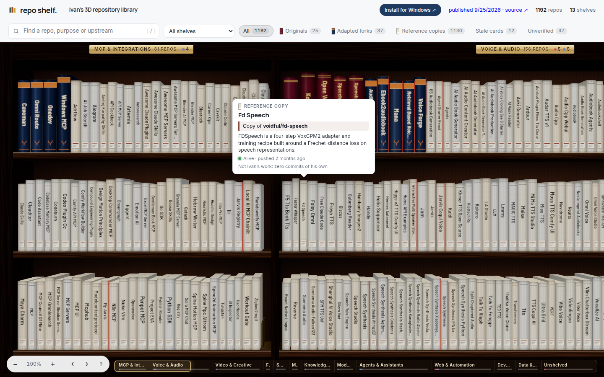
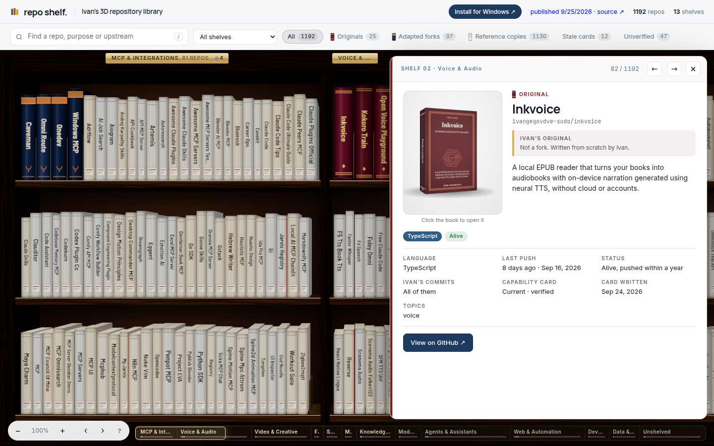
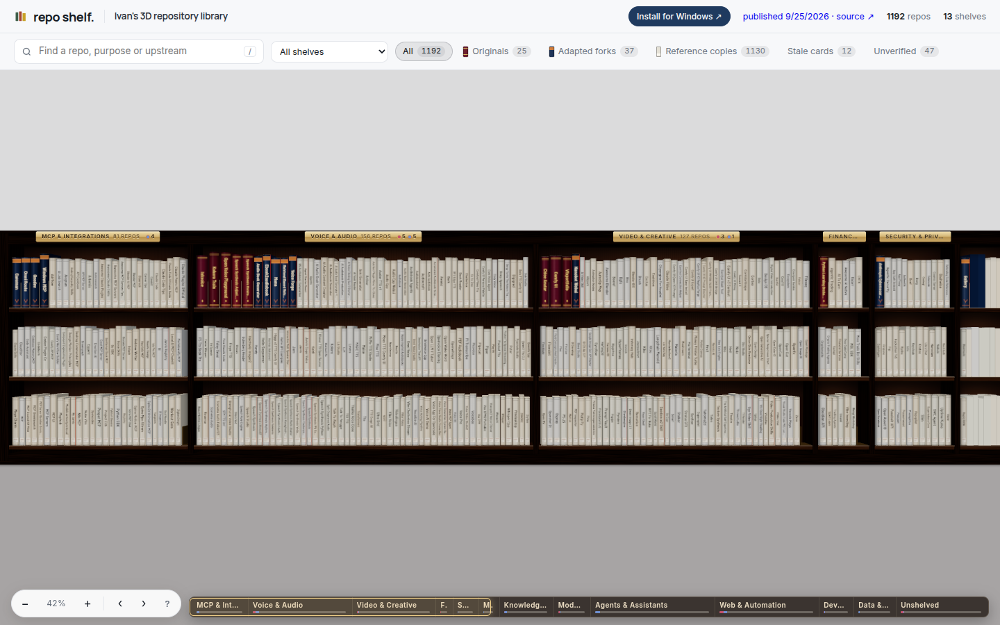
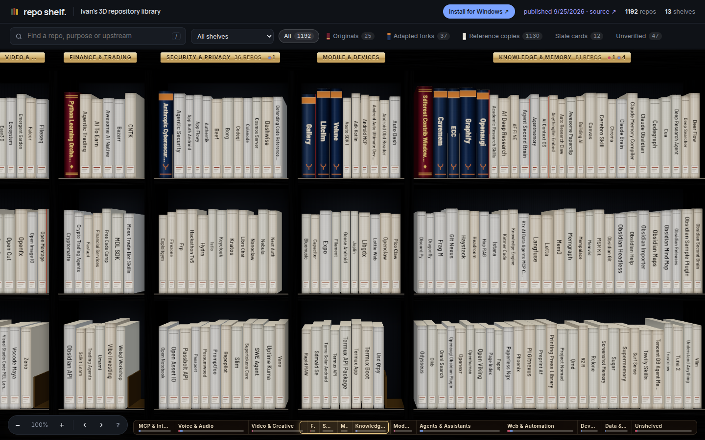
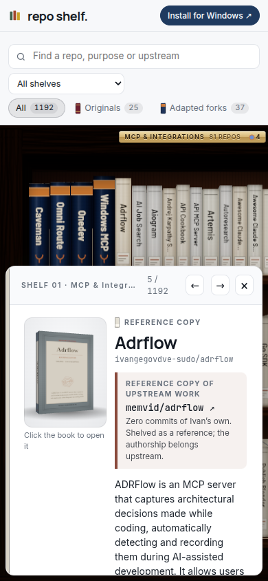
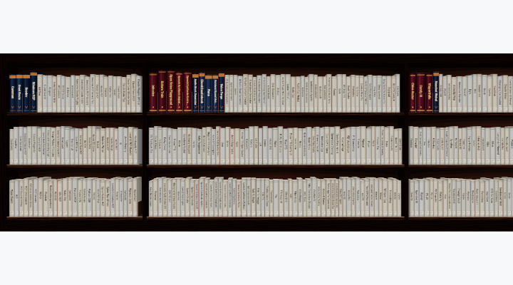

# repo shelf.

[](https://github.com/ivangegovdve-sudo/repo-shelf/actions/workflows/ci.yml) [](LICENSE)

Your git repos as books on a 3D bookshelf, spine-out, the way a real library looks. Every root folder you configure is a bay of the bookcase, and every git repo inside it is a book. Hundreds of spines fit in one window. Hover a spine to see what the repo is, click it to fold the book out into its own window, scroll along the wall, and drag a book into another bay to move the repo on disk.

Built with React Three Fiber, Express, and `gh`. Runs on your machine only. Windows, macOS and Linux.

This fork opens with a complete public repository catalog, regenerated from the live GitHub inventory. Six broad shelves group the smaller purposes: AI & Knowledge, Creative & Media, Software & Systems, Security & Finance, Mobile & Devices, and Other & Exploration. Every repo remains a book, including archived public projects.

The shelf is a wooden wall with one bay per top category, separated by real divider boards. Book cloth, covers and filter swatches share a stable color per smaller purpose. Edition marks show authorship without changing that color:

- **Originals** have gilt rules and an ornament. They are the widest, tallest volumes.
- **Adapted forks** have a copper head band and fork mark.
- **Reference copies** have a library call-number sticker. Their details and published identity lead to upstream, without naming the collecting account.
- **Unverified forks** retain upstream attribution and a fork mark when upstream comparison is unavailable; they make no contribution claim.

Select several top categories or book colors to narrow the wall. Selections combine with search and the optional edition filters: OR within each level, AND across levels. The toolbar shows matching/total counts, named active filters, an empty-result message and a Clear filters control. On phones the category/color rows scroll horizontally. The screen-reader book index follows the same filtered set as the 3D wall.

Inside each bay, originals and adapted forks come first. Hovering or keyboard-focusing a fork names upstream immediately. Clicking a spine folds the book out into a 3D cover with upstream attribution and a readable first page. See [catalog refresh instructions](data/README.md).

The **3D Library / List** toggle switches between the bookcase and a flat repository list, with the same search, category, edition and metadata filters in both. The list opens the same book details and shows language, topics, last update and stars. Your view preference is remembered. Use **Primary language**, **Topic / tag** and **Updated since** together to narrow the collection, or **Clear filters** to restore it. **Hide filters** keeps search, the view toggle and the star slider visible while giving the shelves more room; **Show filters** restores every control without changing your selections.

The **Star threshold** slider walks through the collection's distinct star counts. It starts at zero, removes the lowest-starred books first, and ends with every book tied for the highest count in the current filtered collection. The readout shows the threshold and remaining book count. Books fade and slide off their original shelf positions; moving back restores them, including during an animation. Reduced-motion preferences skip the movement. The wall remains instanced, uses the existing bounded texture atlas, and renders only on demand; List mode stops the wall renderer.

The published site keeps its complete 1,280-book catalog as a fallback and refreshes public star counts, languages, topics and last-push dates through the GitHub API in the background. Public builds also append new entries from `catalog.public.json`, so `npm run catalog:refresh` continues to add books while preserving existing books and attribution. Star counts belong to the collecting account's repositories; reference-copy links and upstream attribution remain intact. An unavailable or rate-limited API leaves the embedded library usable. GitHub Pages still serves the root of the **gh-pages** branch at [the existing live address](https://ivangegovdve-sudo.github.io/repo-shelf/). The Pages workflow publishes to that same branch after tests and the static build pass.



| The library door on your desktop | … swings open | … into the shelf |
| --- | --- | --- |
|  |  |  |

| A spine folded out into its window | Zoomed out, the whole wall | Midnight theme | Phone |
| --- | --- | --- | --- |
|  |  |  |  |

## Share it



The **Share** menu in the header:

- **Shelfie (PNG)**: the current view with a caption bar (your name, repo count, top languages). 1600px, ready to post.
- **Pan GIF**: the camera glides along the whole wall and back in a 3-second loop.
- **Rewind GIF**: every book lands on the shelves in the order you created the repos, with a year counter. Or play it on screen without exporting.
- **Publish my shelf…**: one click turns your public repos into a standalone 3D library site on GitHub Pages, at `https://<you>.github.io/<name>/`. Visitors can browse the shelves, open books, and read the READMEs. Private repos, local-only repos, hidden shelves and file paths never leave your machine; the page carries a "get yours" link back here. Re-publish any time, the link stays. There is also **Export folder only** if you want to host it elsewhere.

Exports land in `shelf-exports/` (or *Pictures/repo shelf* from the desktop widget).

## Desktop widget

A small **library door** sits on your desktop (always on top, drag it anywhere). Click it: the doors swing open and the bookshelf window appears. Close the shelf and you are back at the door. Everything you do there is real: move, rename, create folders, create repos, clone, change visibility, all against your actual git folders and your GitHub account.

```bash
npm run desktop        # build once, then launch the widget
npm run dist:win       # Windows installer + portable exe in release/
npm run dist:mac       # macOS .dmg (run on a Mac)
npm run dist:linux     # AppImage
```

The Windows workflow publishes both an NSIS installer and a portable `.exe` to the `catalog-preview` prerelease. The installer is only called working after that Windows runner completes successfully; a local Linux build is not evidence that a Windows installer launches.

If Windows Defender blocks the build with `EPERM ... win-unpacked.tmp`, build to another drive: `npx electron-builder --win --config.directories.output=D:/repo-shelf-release`.

- Tray icon with **Open the shelf / Show the door / Quit**. `Ctrl+Shift+L` (`⌘⇧L` on macOS) toggles the shelf from anywhere.
- The widget starts its own local server on the first free port from 4877 and keeps `shelf.config.json` in your user data folder once installed.
- `npm run desktop:dev` points the widget at the Vite dev server for hot reload while you work on the UI.

## What a book tells you

| Visual | Meaning |
| --- | --- |
| Spine height | Commit count (log scale) |
| Spine thickness | Size on disk excluding `.git`, `node_modules`, build output |
| Spine color | Primary language (GitHub language when available, otherwise a file-extension guess) |
| Faded, washed-out color | Stale: no commit in the last 90 days (configurable) |
| Gold band near the top | Repo has GitHub stars |
| Red tab at the top corner | Uncommitted changes |
| Yellow dot at the bottom | git could not read the repo |
| Dotted outline, "PUBLIC ↗" or "🔒 PRIVATE" | A GitHub or link book: not on disk yet; the lock marks a private repo |
| "ARCHIVED" stamp | Archived on GitHub |
| Burgundy cloth, gilt title, gilt rules and ornament | Catalog: Ivan's original repository |
| Navy cloth, cream title, copper head band, fork mark | Catalog: a fork carrying commits of Ivan's own. Hover or open it to see the upstream |
| Pale buckram, dark ink, call-number sticker at the foot | Catalog: a reference copy with zero commits of Ivan's. The upstream is named on hover and printed on the cover |
| Thin red line down the spine's edge | Catalog: the capability card is stale or unverified |

## Actions

From the detail panel or by dragging:

- **Move** a repo to another shelf. Moves the folder on disk. Refuses if the name already exists there, and warns when the repo has uncommitted changes.
- **Rename** a repo. Renames the folder. Optionally also renames it on GitHub and updates `origin` when the repo is owned by your `gh` account.
- **New folder** inside a repo, with an optional `.gitkeep`. Paths are confined to the repo.
- **Open** in VS Code, a terminal (Windows Terminal, Terminal.app, or your Linux default), the file manager, or the GitHub page.
- **Clone** a link or GitHub book onto any of your shelves with `git clone`.
- **Create** a brand-new repo on a shelf: `git init`, README, `.gitignore`, first commit, and optionally `gh repo create --push` as public or private.
- **Make public / private**, **archive**, **delete** repos on your GitHub account from their books on the GitHub shelves.

Every action is logged to `.cache/actions.log`. Nothing is ever deleted.

## Run it

Requirements: Node 24, git. Optional: [GitHub CLI](https://cli.github.com/) logged in (`gh auth login`) for descriptions, stars, topics, and language.

```bash
npm install
npm run dev
```

Open http://127.0.0.1:5177. The API runs on http://127.0.0.1:4877 and only accepts local connections.

Production mode serves the built UI from the API server on one port:

```bash
npm run build
npm start
```

Then open http://127.0.0.1:4877.

## Opening a book

Click a spine and the book slides out of the wall and folds out into its own window over the right of the wall. The window shows the 3D book, which turns from spine to cover; click it to swing the cover open to the first page. Beside the book are the repo's edition, who wrote it (for forks, the upstream, with a link), its description, and its facts: language, last push, alive or dormant, and Ivan's commits. Local repos also get their actions and pages: **README** (rendered), **Commits**, **Issues**, **Pull requests**, **Files** and **Branches**, read from disk and git or from the GitHub API. Click any other spine while the window is open and it swaps to that book. Arrow keys walk the wall and Enter opens the focused spine.

## GitHub account shelves

Two shelves list every repo on your GitHub account, split into **GitHub · public** and **GitHub · private**, straight from `gh`. Private spines carry a lock. From a book's page you can clone it onto a folder shelf, make it public or private, archive it, or delete it (you type the name to confirm; needs `gh auth refresh -s delete_repo`). Drag a book from the public shelf to the private one to make it private, and back. Repos you don't own are read-only.

```json
{ "label": "GitHub · public", "github": "me", "visibility": "public" }
{ "label": "GitHub · private", "github": "me", "visibility": "private" }
{ "label": "Everything by octocat", "github": "octocat" }
```

## Guide shelves: the Hermes Agent docs as books

A shelf can hold **guides**: each book is one page of a documentation site, bound in leather. Open it and the doc's sections become pages you turn one at a time (`‹ ›`, PageUp/PageDown, Space), rendered inside the book. The default config ships **Hermes Agent · Docs** with the important parts of the [Hermes Agent documentation](https://hermes-agent.nousresearch.com/docs/) in reading order: Quickstart, Installation, Platform Support, Learning Path, CLI, Configuration, Models, Desktop, Bot Mode, Profiles, Tools, Skills, Memory, MCP, Personality, Voice, Messaging, Cron, Delegation, Security, Creating Skills, Plugins, Architecture, CLI Commands, Environment Variables, FAQ.

The text is fetched straight from the docs' markdown source on GitHub (front matter, imports and embeds stripped, admonitions kept as quotes), cached for five minutes, and each book links to the page on the website and to its source. Guides are included when you publish your shelf.

```json
{
  "label": "Hermes Agent · Docs",
  "links": [
    {
      "name": "Quickstart",
      "url": "https://hermes-agent.nousresearch.com/docs/getting-started/quickstart",
      "doc": "NousResearch/hermes-agent:website/docs/getting-started/quickstart.md",
      "description": "From install to your first conversation in under five minutes."
    }
  ]
}
```

`doc` is `owner/repo:path/to/page.md` (fetched raw from GitHub) or any https URL to a markdown file.

## Link shelves and the secret shelf

A shelf can hold links instead of folders. Each link is a GitHub repo (`slug`) or any https URL, shown as a book with a dotted outline. Open it, or clone it onto a real shelf. The default config ships a **Hermes Agent** shelf with a few genuinely useful public repos.

There is also a hidden shelf. Type `hermes` anywhere in the app to reveal it.

```json
{ "label": "Reading list", "links": [{ "slug": "NousResearch/hermes-agent" }, { "name": "Docs", "url": "https://example.com/docs" }] }
{ "label": "Secret", "hidden": true, "links": [{ "slug": "you/your-private-skills" }] }
```

## Themes and bookcase styles

The theme button in the header switches colors (Slate, Library, Midnight, Nordic, Ink, Forest) and the bookcase build (Classic with back panel and crown, Modern slim, Floating planks). Both are remembered per browser.

## Configure shelves

`shelf.config.json` is created on first run:

```json
{
  "shelves": [
    { "label": "Developer", "path": "C:\\Users\\you\\Developer" },
    { "label": "Documents", "path": "C:\\Users\\you\\Documents" },
    { "label": "Home", "path": "C:\\Users\\you" }
  ],
  "staleAfterDays": 90,
  "githubCacheHours": 24
}
```

Shelf order in the file is shelf order on screen. Each folder shelf is scanned one level deep: every immediate sub-folder that contains `.git` becomes a book. Hidden folders are skipped. You can add and remove shelves from the **Shelves** button in the header. On macOS and Linux the default home shelves are `~/Developer`, `~/Documents`, and `~`.

Environment overrides: `SHELF_CONFIG` (config file path), `SHELF_CACHE` (cache directory), `SHELF_PORT` (API port).

`SHELF_CATALOG` overrides the bundled public catalog path. `npm run catalog:refresh -- /path/to/repoindex/catalog.json` refreshes the checked-in public-only snapshot after intersecting it with GitHub's public repository inventory.

The capability-card catalog in `data/catalog.public.json` contains 1,280 public repositories. The Pages build uses `data/library.public.json` to retain all 1,280 books from the existing deployed library, appends new catalog entries, and refreshes their public metadata before publishing. To update that fallback snapshot explicitly, run `node --import tsx scripts/refresh-public-library.ts`; set `SHELF_SKIP_GITHUB_REFRESH=1` for a completely offline Pages build. To browse the complete repoindex on your own machine, build a separate local-only shelf from the full catalog:

```bash
npm run build:library:local -- /path/to/repoindex/catalog.json
```

Open `catalog-full-site/index.html` directly from disk. The command verifies that every catalog entry became exactly one book. That output is gitignored because it may contain non-public repository names; do not publish it or add it to a release.

## Provenance

The 3D bookshelf application was created by [BkashJEE](https://github.com/BkashJEE/repo-shelf) and remains MIT licensed. This fork's catalog integration and deployment are maintained at [ivangegovdve-sudo/repo-shelf](https://github.com/ivangegovdve-sudo/repo-shelf).

## Keyboard

| Key | Action |
| --- | --- |
| `/` | Focus search |
| Mouse wheel, trackpad swipe, or drag the wall | Move along the wall (drag and release to fling) |
| `←` `→` | Previous / next spine along the wall |
| `↑` `↓` | The spine on the row above / below, in the same bay |
| `Page Up` `Page Down`, `Home` `End` | Previous / next category bay, first / last spine |
| `Enter` or `Space` | Open the focused spine in its window (swaps the open window) |
| `Esc` | Close the window, then clear the focus; in the search box, clear the search |
| `ctrl` + wheel, trackpad pinch, `+` `-` | Zoom in / out around the pointer (20% shows the whole wall) |
| Double-click a spine | Zoom right up to it |
| `0` or double-click the wood | Back to 100 % |
| Category strip along the bottom | Click or drag to travel to any bay |

## Performance

The wall draws every spine, all 1,256 in the full catalog, in 9 to 20 draw calls. Planks, dividers, back panels and baked shade are merged meshes. The spines are instanced meshes that share a texture atlas.

A spine needs far less texture than a cover. Spines are lettered lazily, only when they first scroll into view. Each is 256 texels tall, and they are shelf-packed into 1024² atlas pages. The atlas is capped at 16 pages (85.3 MiB with mipmaps) and recycles the least recently seen page when full. Full covers and first pages exist only for the open book, in a 6-entry cache. The worst case for everything the wall can hold at once is 140 MiB, which `tests/texture-budget.test.ts` keeps below 160 MiB.

To measure your own machine, open the browser console on the shelf and run `await __measureWall()`. It glides the whole wall and reports the frame rate, frame times and the texture cache. `__wallStats()` reports the cache alone.

## Tests

```bash
npm test          # server + derive unit tests (vitest, real temp git repos)
npm run test:e2e  # Playwright against fixture repos in a temp folder
```

## Layout

```
server/   Express API: config, scanner, GitHub enrichment, actions, SSE
src/      React + R3F UI: scene/ (spine-out wall, spine atlas, camera, book viewer textures), ui/ (book window, overlays, dialogs), store, derive
tests/    vitest unit tests and Playwright e2e
docs/     design spec and implementation plan
```
